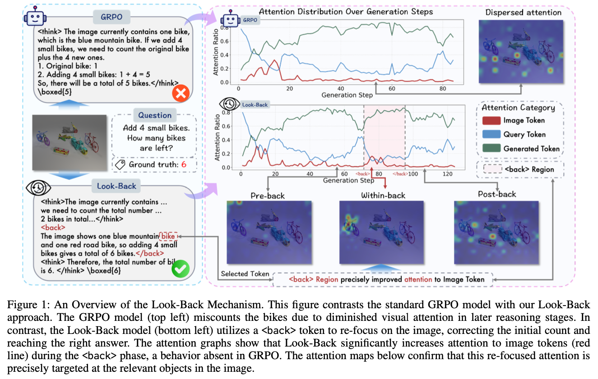

# Look-Back: Implicit Visual Re-focusing in MLLM Reasoning
[](https://arxiv.org/abs/2507.03019) [](https://huggingface.co/ShuoY)


> **This repository is the official implementation of "Look-Back: Implicit Visual Re-focusing in MLLM Reasoning".**  
> Look-Back enables Multimodal Large Language Models (MLLMs) to autonomously determine **when**, **where**, and **how** to re-focus on visual inputs during reasoning—without explicit visual information injection.

---

## 🔍 Overview

Most MLLMs tend to ignore visual input during later reasoning stages, overly relying on text. Look-Back is a novel **implicit** method that introduces a `<back>` mechanism, prompting the model to **self-reflect** on the visual input when needed—without changing the model architecture or re-injecting images.

We achieve this via a **two-stage training framework**:
1. **Cold-start Supervised Fine-Tuning (SFT)**: Injects structured `<back>` tokens into the model’s reasoning traces.
2. **Reinforcement Learning (RL)**: Applies a reward based on the `<back>` token to encourage visual reflection.

<p align="center">
  
</p>

The model learns to re-focus attention to visual details in a human-like fashion, significantly improving performance across 8 multimodal reasoning benchmarks (e.g., MathVista, MME, HalluBench, etc.).


## ⚙️ Environment Setup
To set up your environment for Look-Back:
  ```bash
    cd LooK-Back
    conda env create -f environment.yml
    conda activate back
  ```

## 🚀 Quick Start

To use the pre-trained models and evaluation data, follow the steps below:

1. **Download Pre-trained Models:**
   The models are available on Hugging Face. You can download them to the following paths:
   
   - **Semantic-back-7B**: [Download here](https://huggingface.co/ShuoY/Semantic-back-7B)  
     Save it to `LooK-Back/MLLMs/Semantic-back-7B`
   - **Solution-back-7B**: [Download here](https://huggingface.co/ShuoY/Solution-back-7B)  
     Save it to `LooK-Back/MLLMs/Solution-back-7B`

2. **Download Evaluation Data:**
   The evaluation dataset is also available on Hugging Face. You can download it and unzip it to the following path:
   
   - **Evaluation Data**: [Download here](https://huggingface.co/datasets/ShuoY/Look-Back-eval)  
     Unzip the data to `LooK-Back/eval/eval_data`

3. **Evaluate the Model:**
   Follow these steps to start the evaluation process:

   - **Step 1**: Before running the evaluation scripts, update the script with the absolute paths for the model and evaluation directory. Open `Semantic-back-eval.sh` and `Solution-back-eval.sh`, and modify the following lines:
    ```bash
      HF_MODEL="/absolute/path/to/LooK-Back/MLLMs/Semantic-back-7B"
      EVAL_DIR="/absolute/path/to/LooK-Back/eval"
    ```
    Replace `/absolute/path/to/` with the actual path to your project directory.

   - **Step 2**: Run the evaluation scripts for  `Semantic-back-7B ` and  `Solution-back-7B `.

    ```bash
      bash eval/scripts/Semantic-back-eval.sh
      bash eval/scripts/Solution-back-eval.sh
    ```

   - **Step 1**: After the evaluation completes, results will be saved in the model's folder under the  `results ` directory. You can then run the following command to calculate the evaluation scores:

    ```bash
    python eval/cal_score.py --folder_path path_to_results
    ```

  Replace path_to_results with the actual path to the results folder generated after evaluation.


## 📊 Attention Trend Visualization Demo
This section demonstrates how to visualize the attention trends in your multimodal model using demo images. The demo images and their corresponding questions are located in the `vis_demo/fig` folder. The questions are listed in the `fig/question.md` file.

Follow the steps below to run the demo:
### Step 1: Navigate to the `vis_demo` folder
First, navigate to the `vis_demo` directory where the demo images and questions are stored.
```bash
cd vis_demo
```
### Step 2: Select a Demo Image and Question
There are four demo images available, each with a corresponding question. You can choose the image and question you want to visualize. The images are located in the `fig` folder, and the questions are stored in `fig/question.md`.

### Step 3: Run the Visualization Script
For the `Semantic-back-7B` model, the script to visualize the attention trends is as follows:
```bash
IMAGE_DIR="./fig"
IMAGE_NAME="demo1.jpg"  # Choose from demo1.jpg, demo2.jpg, demo3.png, demo4.png
QUESTION="Is this photo taken in a place of youth hostel?"  # Find the corresponding question in question.md

python att_trend_viz.py \
  --image_path "${IMAGE_DIR}/${IMAGE_NAME}" \
  --question "$QUESTION" \
  --mode back \
  --model_path "../MLLMs/Semantic-back-7B" \
  --save_folder "./results/Semantic-back" \
  --device "cuda:0"
```
- IMAGE_DIR: Set to `./fig` to reference images in the fig folder.
- IMAGE_NAME: Change this variable to the image you want to visualize (e.g., `demo1.jpg`, `demo2.jpg`, etc.).
- QUESTION: Set this variable to the corresponding question from the `fig/question.md` file.

### Step 4: Check the Results
The results will be saved in the `results` folder within the corresponding model directory (e.g., `results/Semantic-back`). The visualized attention trends will be available after running the script.


## 📦 Folder Structure
Once the models and datasets are downloaded, your folder structure should look like this:
<pre> 
LooK-Back/
├── eval/
│ ├── eval_data/
│ ├── scripts/
│ ├── utils/ 
│ │ ├── cal_score.py 
│ │ └── main.py
├── MLLMs/
│ ├── Semantic-back-7B/
│ └── Solution-back-7B/
├── vis_demo/ 
│ ├── fig/
│ ├── results/
│ └── att_trend_viz.py 
└── README.md 
</pre>

## 🚧 TODO

- ✅ 🧠 Release the trained **Look-Back models** (`Semantic-back` and `Solution-back`) based on Qwen-2.5-VL-7B
- ✅ 📊 Release the demo code for visualizing attention trends
- ✅ 📈 Release **evaluation scripts and benchmark loaders**
- ⬜️ 📦 Release the training datasets
- ⬜️ 🧹 The full codebase is being **cleaned and documented**

## 🙏 Acknowledgements
* The training codes are built on [EasyR1](https://github.com/hiyouga/EasyR1)
* The evaluation scripts in this repository were built on top of the excellent work from the [NoisyRollout](https://github.com/NUS-TRAIL/NoisyRollout) repository.
We gratefully acknowledge the authors of this project for their contributions.
